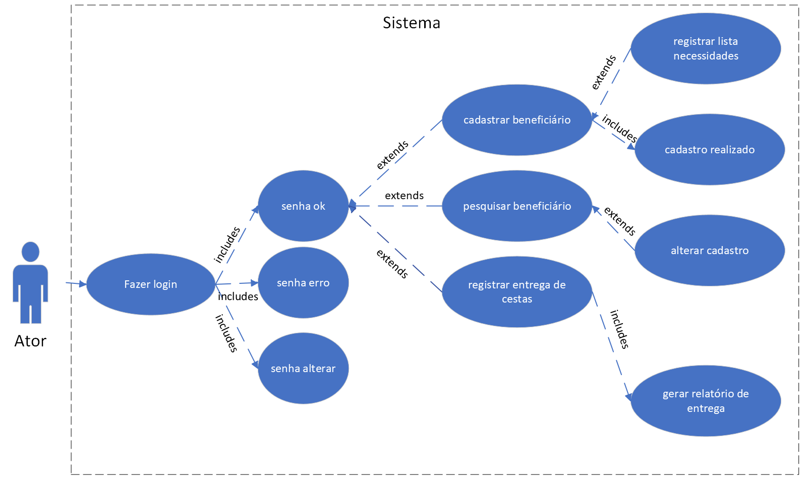

# Especificações do Projeto

Pré-requisitos: <a href="1-Documentação de Contexto.md"> Documentação de Contexto</a>

Definição do problema e ideia de solução a partir da perspectiva do usuário. É composta pela definição do  diagrama de personas, histórias de usuários, requisitos funcionais e não funcionais além das restrições do projeto.

Apresente uma visão geral do que será abordado nesta parte do documento, enumerando as técnicas e/ou ferramentas utilizadas para realizar a especificações do projeto

## Personas
<table>
  <tr>
    <th>Foto</th>
    <th>Nome</th>
    <th>Descrição</th>
    <th>Aplicativos</th>
    <th>Motivações</th>
    <th>Frustrações</th>
    <th>Hobbies</th>
  </tr
        <tr>
    <td></td>
    <td>Maria Aparecida</td>
    <td>
      <ul>
        <li>68 anos</li>
        <li>Aposentada</li>
        <li>Mora em uma casa de taipa em Maruim/SE.</li>
      </ul>
    </td>
    <td>
      <ul>
        <li>Não usa redes sociais</li>
         </ul>
    </td>
    <td>
      <ul>
        <li>Cuidar da família</li>
        <li>Prover a subsistência dos filhos</li>
      </ul>
    </td>
    <td>
      <li>Não terminou o ensino fundamental</li>
      <li>Possui filhos desempregados</li>
    </td>
    <td>
      <li>Ver novelas</li>
      <li>Costurar</li
    </td>
  </tr>
  <tr>
      <td></td>
    <td>Gisele Pereira</td>
    <td>
      <ul>
        <li>36 anos</li>
        <li>Advogada</li>
        <li>Mora em Recife/SE.</li>
      </ul>
    </td>
    <td>
      <ul>
        <li>É familiar com todas as rede sociais</li>
      </ul>
    </td>
    <td>
      <ul>
        <li> Finalizar seu mestrado.</li>
        <li> Contribuir em projetos sociais.</li>
      </ul>
    </td>
    <td>
      <li> Dificuldades no processo operacional na entrega de cestas do projeto social em que é voluntária. </li>
     </td>
    <td>
      <li> Ler livros.</li>
      <li>Cozinhar com o filho</li>
    </td>
  </tr>
    <tr>
    <td></td>
      <td>Túlio Almeida</td>
    <td>
      <ul>
        <li>31 anos</li>
        <li>Engenheiro Químico</li>
        <li>Mora em Recife/SE.</li>
      </ul>
    </td>
    <td>
      <ul>
        <li>Familiar com todas as redes sociais.</li
        </ul>
    </td>
    <td>
      <ul>
        <li> Contribuir no gerenciamento de coleta e entrega de cestas básicas à comunidades carentes.</li>
      </ul>
    </td>
    <td>
      <li> Dificuldades em identificar a população carente atendinda devido a limitação da identificação apenas por Rg ou cpf(pois muitas não apresentam ou não tem documento).</li>
         </td>
    <td>
      <li> Política</li>
      <li> Música</li>
    </td>
  </tr>
  <tr>
     <td></td>
    <td>Manoel Martins</td>
    <td>
      <ul>
        <li>31 anos</li>
        <li>Vendedor</li>
        <li>Mora em Recife/SE</li>
      </ul>
    </td>
    <td>
      <ul>
        <li> Usa apenas redes sociais essesnciais como Whatssap, gmail.</li> 
      </ul>
    </td>
    <td>
      <ul>
        <li> Continuar ajudando famílias carentes da região.</li>
      </ul>
    </td>
    <td>
      <li> Atualização mensal dos dados em tabelas (no excel) referente a entrega de cestas.</li>
        </td>
    <td>
      <li> Participar do Grupo Espríta.</li>
    </td>
  </tr>
  <tr>
</table>

Enumere e detalhe as personas da sua solução. Para tanto, baseie-se tanto nos documentos disponibilizados na disciplina e/ou nos seguintes links:

> **Links Úteis**:
> - [Rock Content](https://rockcontent.com/blog/personas/)
> - [Hotmart](https://blog.hotmart.com/pt-br/como-criar-persona-negocio/)
> - [O que é persona?](https://resultadosdigitais.com.br/blog/persona-o-que-e/)
> - [Persona x Público-alvo](https://flammo.com.br/blog/persona-e-publico-alvo-qual-a-diferenca/)
> - [Mapa de Empatia](https://resultadosdigitais.com.br/blog/mapa-da-empatia/)
> - [Mapa de Stalkeholders](https://www.racecomunicacao.com.br/blog/como-fazer-o-mapeamento-de-stakeholders/)
>
Lembre-se que você deve ser enumerar e descrever precisamente e personalizada todos os clientes ideais que sua solução almeja.

## Histórias de Usuários

Com base na análise das personas forma identificadas as seguintes histórias de usuários:

|EU COMO... `PERSONA`| QUERO/PRECISO ... `FUNCIONALIDADE` |PARA ... `MOTIVO/VALOR`                 |
|--------------------|------------------------------------|----------------------------------------|
|Diretor do projeto | Gerenciar as entregas do mês           | Permitir o controle das doações               |
|Voluntário/usuário       | Cadastrar as famílias                 | Permitir que os beneficiários aptos sejam inseridos no sistema do programa |
|Voluntário/usuário       | Atualizar cadastro do beneficiado                 | Permitir que os dados cadastrais dos beneficiários sejam atualizados inseridos no sistema do programa |
|Voluntário/usuário       | Registrar entrega da cesta                 | Permitir o registro de entrega da cesta do mês |
|Voluntário/usuário       | Registrar as necessidades essenciais                 | Permitir o registro de listas de necessidades essenciais atreladas a cada família |
|Voluntário/usuário       | Consultar histórico do beneficiado                 | Permitir que o usuário possa identificar possíveis mudanças no fluxo das entregas passadas |
|Voluntário/usuário       | Gerar relatório de entrega das cestas                 | Permitir que um relatório seja gerado com informações sobre a entrega daquele período |

## Modelagem do Processo de Negócio 

### Análise da Situação Atual

Apresente aqui os problemas existentes que viabilizam sua proposta. Apresente o modelo do sistema como ele funciona hoje. Caso sua proposta seja inovadora e não existam processos claramente definidos, apresente como as tarefas que o seu sistema pretende implementar são executadas atualmente, mesmo que não se utilize tecnologia computacional. 

### Descrição Geral da Proposta

Apresente aqui uma descrição da sua proposta abordando seus limites e suas ligações com as estratégias e objetivos do negócio. Apresente aqui as oportunidades de melhorias.

### Processo 1 – NOME DO PROCESSO

Apresente aqui o nome e as oportunidades de melhorias para o processo 1. Em seguida, apresente o modelo do processo 1, descrito no padrão BPMN. 

### Processo 2 – NOME DO PROCESSO

Apresente aqui o nome e as oportunidades de melhorias para o processo 2. Em seguida, apresente o modelo do processo 2, descrito no padrão BPMN.

## Indicadores de Desempenho

Apresente aqui os principais indicadores de desempenho e algumas metas para o processo. Atenção: as informações necessárias para gerar os indicadores devem estar contempladas no diagrama de classe. Colocar no mínimo 5 indicadores. 

Usar o seguinte modelo: 

Obs.: todas as informações para gerar os indicadores devem estar no diagrama de classe a ser apresentado a posteriori. 

## Requisitos

As tabelas que se seguem apresentam os requisitos funcionais e não funcionais que detalham o escopo do projeto. Para determinar a prioridade de requisitos, aplicar uma técnica de priorização de requisitos e detalhar como a técnica foi aplicada.

### Requisitos Funcionais

|ID    | Descrição do Requisito  | Prioridade |
|------|-----------------------------------------|----|
|RF-001| Permitir login dos usuários | ALTA | 
|RF-002| Permitir logoff dos usuários   | ALTA |
|RF-003| Permitir cadastro de beneficiários | ALTA | 
|RF-004| Consultar por beneficiários  | ALTA |
|RF-005| Permitir atualização dos dados cadastrados dos beneficiários | ALTA | 
|RF-006| Permitir a exclusão dos dados cadastrados dos usuários   | ALTA |
|RF-007| Permitir a inserção de itens na lista de necessidades essenciais | ALTA | 
|RF-008| Permitir edição das listas de necessidades  | ALTA|
|RF-009| Registrar a entrega das cestas | ALTA | 
|RF-010| Gerar histórico dos beneficiários   | ALTA |

### Requisitos não Funcionais

|ID     | Descrição do Requisito  |Prioridade |
|-------|-------------------------|----|
|RNF-001| O sistema deve ser desenvolvido para dispositivo móvel | ALTA | 
|RNF-002| O sistema deve ser desenvolvido em JavaScript (framework React Native) |  MÉDIA| 
|RNF-003| O sistema deve está disponível online e offline | ALTA | 
|RNF-004| O sistema deve exigir identificação prévia | ALTA | 
|RNF-005| O sistema deve ser utilizável |  ALTA |
|RNF-006| O sistema deve conter mensagens de erro | ALTA|

## Restrições

O projeto está restrito pelos itens apresentados na tabela a seguir.

|ID| Restrição                                             |
|--|-------------------------------------------------------|
|01| O projeto deverá ser entregue até o final do semestre |
|02| O sistema deve atender às necessidades e expectativas dos usuários        |
|03| O sistema deve atender às leis e a regulamentos aplicáveis, como a LGPD        |

## Diagrama de Casos de Uso

As referências abaixo irão auxiliá-lo na geração do artefato “Diagrama de Casos de Uso”.

> **Links Úteis**:
> - [Criando Casos de Uso](https://www.ibm.com/docs/pt-br/elm/6.0?topic=requirements-creating-use-cases)
> - [Como Criar Diagrama de Caso de Uso: Tutorial Passo a Passo](https://gitmind.com/pt/fazer-diagrama-de-caso-uso.html/)
> - [Lucidchart](https://www.lucidchart.com/)
> - [Astah](https://astah.net/)
> - [Diagrams](https://app.diagrams.net/)

# Matriz de Rastreabilidade

A matriz de rastreabilidade é uma ferramenta usada para facilitar a visualização dos relacionamento entre requisitos e outros artefatos ou objetos, permitindo a rastreabilidade entre os requisitos e os objetivos de negócio. 

A matriz deve contemplar todos os elementos relevantes que fazem parte do sistema, conforme a figura meramente ilustrativa apresentada a seguir.

> **Links Úteis**:
> - [Artigo Engenharia de Software 13 - Rastreabilidade](https://www.devmedia.com.br/artigo-engenharia-de-software-13-rastreabilidade/12822/)
> - [Verificação da rastreabilidade de requisitos usando a integração do IBM Rational RequisitePro e do IBM ClearQuest Test Manager](https://developer.ibm.com/br/tutorials/requirementstraceabilityverificationusingrrpandcctm/)
> - [IBM Engineering Lifecycle Optimization – Publishing](https://www.ibm.com/br-pt/products/engineering-lifecycle-optimization/publishing/)

# Gerenciamento de Projeto

De acordo com o PMBoK v6 as dez áreas que constituem os pilares para gerenciar projetos, e que caracterizam a multidisciplinaridade envolvida, são: Integração, Escopo, Cronograma (Tempo), Custos, Qualidade, Recursos, Comunicações, Riscos, Aquisições, Partes Interessadas. Para desenvolver projetos um profissional deve se preocupar em gerenciar todas essas dez áreas. Elas se complementam e se relacionam, de tal forma que não se deve apenas examinar uma área de forma estanque. É preciso considerar, por exemplo, que as áreas de Escopo, Cronograma e Custos estão muito relacionadas. Assim, se eu amplio o escopo de um projeto eu posso afetar seu cronograma e seus custos.

## Gerenciamento de Tempo

Com diagramas bem organizados que permitem gerenciar o tempo nos projetos, o gerente de projetos agenda e coordena tarefas dentro de um projeto para estimar o tempo necessário de conclusão.

O gráfico de Gantt ou diagrama de Gantt também é uma ferramenta visual utilizada para controlar e gerenciar o cronograma de atividades de um projeto. Com ele, é possível listar tudo que precisa ser feito para colocar o projeto em prática, dividir em atividades e estimar o tempo necessário para executá-las.

## Gerenciamento de Equipe

O gerenciamento adequado de tarefas contribuirá para que o projeto alcance altos níveis de produtividade. Por isso, é fundamental que ocorra a gestão de tarefas e de pessoas, de modo que os times envolvidos no projeto possam ser facilmente gerenciados. 

## Gestão de Orçamento

O processo de determinar o orçamento do projeto é uma tarefa que depende, além dos produtos (saídas) dos processos anteriores do gerenciamento de custos, também de produtos oferecidos por outros processos de gerenciamento, como o escopo e o tempo.

