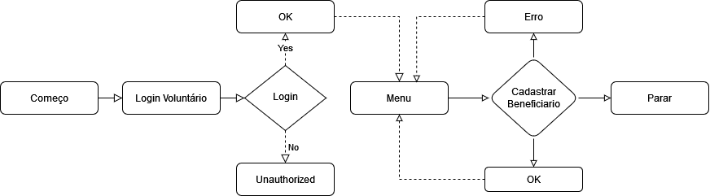
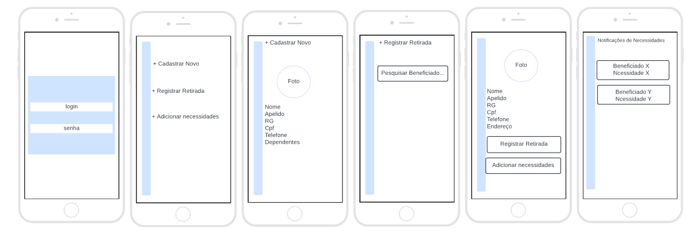
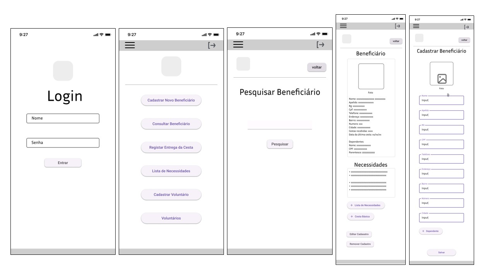
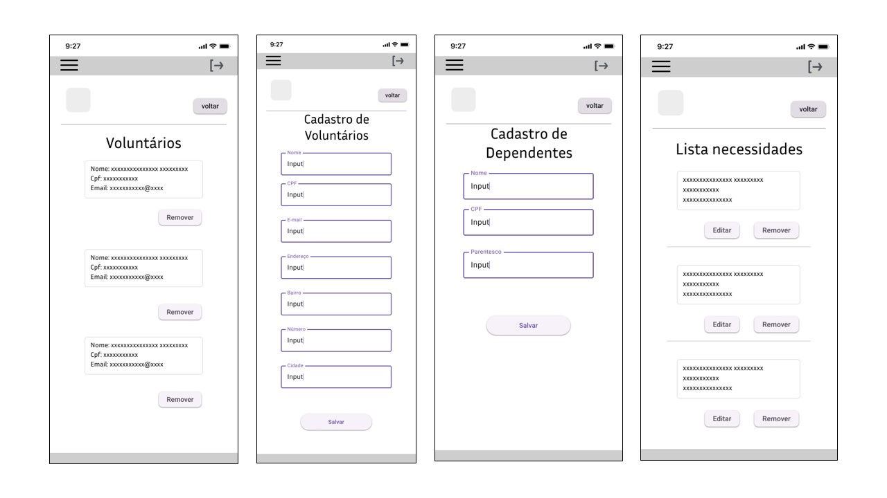

# Projeto de Interface

Pré-requisitos: <a href="2-Especificação do Projeto.md"> Documentação de Especificação</a>

O projeto de interface visa a interação intuitiva e limpa, a fim de impactar de forma positiva o usuário do sistema. A idealização de um modelo mais enxuto favorece o uso de forma rápida e descomplicada.

O usuário do sistema terá acesso à tela de login. Após autenticação, ele deve prosseguir para o menu principal. A partir do menu, a aplicação se desdobra em funcionalidades do sistema: inserção e consulta de beneficiários, inserção de voluntários, área para registro de cestas e listas de necessidades de cada família beneficiada.

## Diagrama de Fluxo

> **Links Úteis**:
> - [Fluxograma online: seis sites para fazer gráfico sem instalar nada | Produtividade | TechTudo](https://www.techtudo.com.br/listas/2019/03/fluxograma-online-seis-sites-para-fazer-grafico-sem-instalar-nada.ghtml)

## Wireframes

## Protótipo de baixa fidelidade

 
> **Links Úteis**:
> - [Protótipos vs Wireframes](https://www.nngroup.com/videos/prototypes-vs-wireframes-ux-projects/)
> - [Ferramentas de Wireframes](https://rockcontent.com/blog/wireframes/)
> - [MarvelApp](https://marvelapp.com/developers/documentation/tutorials/)
> - [Figma](https://www.figma.com/)
> - [Adobe XD](https://www.adobe.com/br/products/xd.html#scroll)
> - [Axure](https://www.axure.com/edu) (Licença Educacional)
> - [InvisionApp](https://www.invisionapp.com/) (Licença Educacional)
