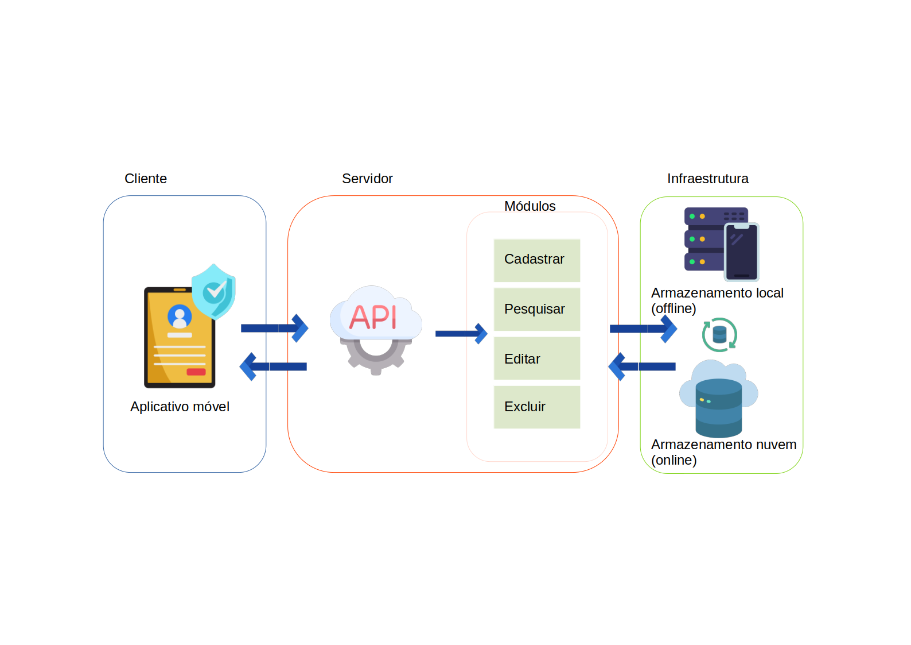
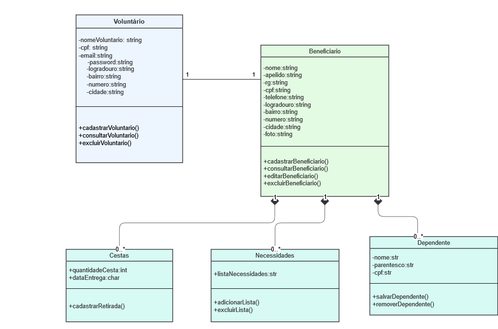
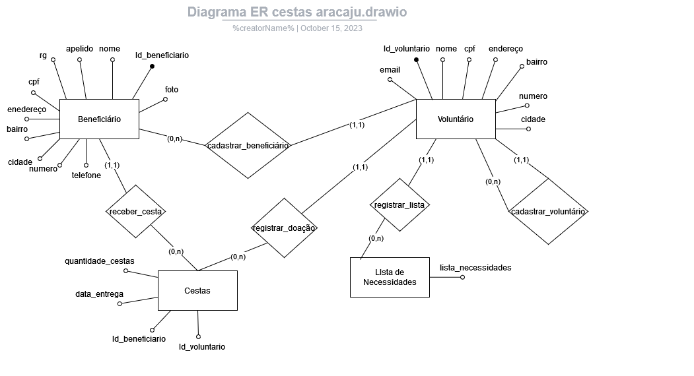
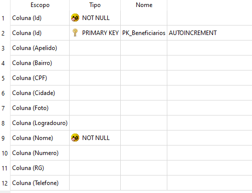
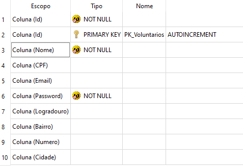
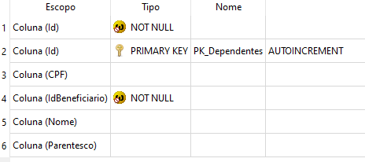
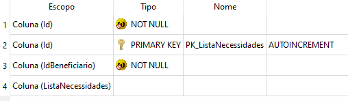
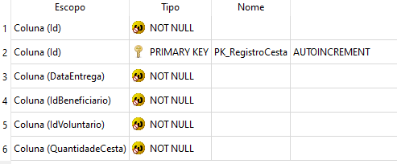

# Arquitetura da Solução

Pré-requisitos: <a href="3-Projeto de Interface.md"> Projeto de Interface</a>

Definição de como o software é estruturado em termos dos componentes que fazem parte da solução e do ambiente de hospedagem da aplicação.

## Diagrama de Classes

## Modelo ER

## Esquema Relacional

*Tabela Beneficiários*

*Tabela Voluntários*

*Tabela Dependentes*

*Tabela Lista de Necessidades*

*Tabela Registro de Cestas*

## Modelo Físico

[Modelo físico do banco de dados](src/db)

## Tecnologias Utilizadas

As tecnologias utilizadas no desenvolvimento do software foram:

- Desenho de protótipo: **Figma**
- Desenvolvimento Back-end:**.NET 6.0**;
- Framework Teste: **NUnit**;
- Servidor do banco de dados: **SQLite**;
- Desenvolvimento Front-end: **--**;
- Armazenamento de objetos: **--**;
- Hospedagem em Nuvem: **--**;

## Hospedagem

Explique como a hospedagem e o lançamento da plataforma foi feita.

> **Links Úteis**:
>
> - [Website com GitHub Pages](https://pages.github.com/)
> - [Programação colaborativa com Repl.it](https://repl.it/)
> - [Getting Started with Heroku](https://devcenter.heroku.com/start)
> - [Publicando Seu Site No Heroku](http://pythonclub.com.br/publicando-seu-hello-world-no-heroku.html)

## Qualidade de Software

- Usabilidade

|-| O sistema deve ser pensado para o usuário|
|--|-------------------------------------------------------|
|Estímulo| O Usuário realiza ações específicas e objetivas no sistema.|
|Fonte do estímulo| Usuário.|
|Ambiente| Sistema com carga normal.|
|Artefato| Sistema como um todo.|
|Resposta| Fluxo do usuário sem interrupções e com fácil navegabilidade.|
|Medida de resposta| O usuário consegue finalizar as tarefas específicas, do início ao fim, no sistema.|

- Disponibilidade

|-| O sistema deve estar disponível em horário integral, durante 24h por dia e sete dias por semana|
|--|-------------------------------------------------------|
|Estímulo| Usuário acessa sistema no domingo no periódo da madrugada.|
|Fonte do estímulo| Usuário.|
|Ambiente| Sistema como carga normal.|
|Artefato| Sistema como um todo.|
|Resposta| O sistema deve permitir o acesso ao usuário em qualquer hora, seja do dia ou noite.|
|Medida de resposta| Todas tentativas de acesso e requisição de informações ao sistema devem ser respondidas.|

- Modificabilidade

|-| O sistema deve ser modular e componentizado, utilizando orientação a objetos e ser construído com arquitetura distribuída|
|--|-------------------------------------------------------|
|Estímulo| Construção e integração de um novo módulo com ouros módulos da arquitetura distribuída.|
|Fonte do estímulo| Desenvolvedor de software.|
|Ambiente| Ambiente de desenvolvimento.|
|Artefato| Módulos de informações cadastrais.|
|Resposta| Módulos pré-existentes do sistema se comunicando com o novo módulo com baixo acoplamento.|
|Medida de resposta|Qualquer intervenção de um ou mais módulos não gera reflexos generalizados no ambiente como um todo e a disponobilização de um novo módulo não interrompe os outros em funcionamento.|

- Interoperabilidade

|-| O sistema deverá interoperar com aplicações legadas com baixo acoplamento utilizando APIs ou outros recursos para consumo de serviços|
|--|-------------------------------------------------------|
|Estímulo| O sistema para completar uma operação precisa recuperar uma informação que está localizada no domínio de uma aplicação legada.|
|Fonte do estímulo|O sistema como um todo.|
|Ambiente| Sistema com carga normal.|
|Artefato| Módulo de informações cadastrais.|
|Resposta| Troca de informações com os sistemas legados.|
|Medida de resposta| Conexão, envio de mensagens e/ou requisições e/ou respostas provenientes de aplicações legadas.|

> **Links Úteis**:
>
> - [ISO/IEC 25010:2011 - Systems and software engineering — Systems and software Quality Requirements and Evaluation (SQuaRE) — System and software quality models](https://www.iso.org/standard/35733.html/)
> - [Análise sobre a ISO 9126 – NBR 13596](https://www.tiespecialistas.com.br/analise-sobre-iso-9126-nbr-13596/)
> - [Qualidade de Software - Engenharia de Software 29](https://www.devmedia.com.br/qualidade-de-software-engenharia-de-software-29/18209/)
