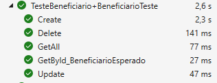
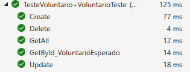
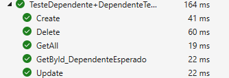
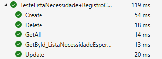
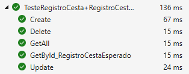

# Plano de Testes de Software

Pré-requisitos: <a href="2-Especificação do Projeto.md"> Especificação do Projeto</a>, <a href="3-Projeto de Interface.md"> Projeto de Interface</a>

Cenário de teste: Classe BeneficiariosController

Grupo escolhido: Desenvolvedores

Tipo Teste: Unitário

Ferramentas utilizadas: AspNet.Core (framework) e Nunit (Framework de teste)

Funcionalidade: Gravar, Pesquisar e Excluir cadastro de beneficiários

Cenário de teste: Classe VoluntariosController

Grupo escolhido: Desenvolvedores

Tipo Teste: Unitário

Ferramentas utilizadas: AspNet.Core (framework) e Nunit (Framework de teste)

Funcionalidade: Gravar, Pesquisar e Excluir cadastro de voluntários

Cenário de teste: Classe DependentesController

Grupo escolhido: Desenvolvedores

Tipo Teste: Unitário

Ferramentas utilizadas: AspNet.Core (framework) e Nunit (Framework de teste)

Funcionalidade: Gravar, Pesquisar e Excluir cadastro de dependentes

Cenário de teste: Classe LIstaNecessidadesController

Grupo escolhido: Desenvolvedores

Tipo Teste: Unitário

Ferramentas utilizadas: AspNet.Core (framework) e Nunit (Framework de teste)

Funcionalidade: Gravar, Pesquisar e Excluir cadastro de listas de necessidades dos beneficiários

Cenário de teste: Classe RegistroCestasController

Grupo escolhido: Desenvolvedores

Tipo Teste: Unitário

Ferramentas utilizadas: AspNet.Core (framework) e Nunit (Framework de teste)

Funcionalidade: Gravar, Pesquisar e Excluir cadastro de entrega de cestas

 
## Ferramentas de Testes (Opcional)

Para implementação e execução do código de teste, utilizamos o NUnit, um framework de teste do .NET. Ele é amplamente utilizado para facilitar e automatizar os testes unitários, que são focados em partes específicas de código, isolando e garantindo seu funcionamento. 
Sua estrutura consiste nos métodos SetUp, TearDown e Test. O SetUp é utilizado para configurar o ambiente de teste, como criar um banco de dados em memória e criar uma instância do banco e do controlador para serem testados. 
O TearDown é o método para fazer a limpeza do banco de dados em memória após a execução do teste. 
O método Test é onde o código real será executado e o resultado do teste será verificado.
 
> **Links Úteis**:
> - [IBM - Criação e Geração de Planos de Teste](https://www.ibm.com/developerworks/br/local/rational/criacao_geracao_planos_testes_software/index.html)
> - [Práticas e Técnicas de Testes Ágeis](http://assiste.serpro.gov.br/serproagil/Apresenta/slides.pdf)
> -  [Teste de Software: Conceitos e tipos de testes](https://blog.onedaytesting.com.br/teste-de-software/)
> - [Criação e Geração de Planos de Teste de Software](https://www.ibm.com/developerworks/br/local/rational/criacao_geracao_planos_testes_software/index.html)
> - [Ferramentas de Test para Java Script](https://geekflare.com/javascript-unit-testing/)
> - [UX Tools](https://uxdesign.cc/ux-user-research-and-user-testing-tools-2d339d379dc7)
