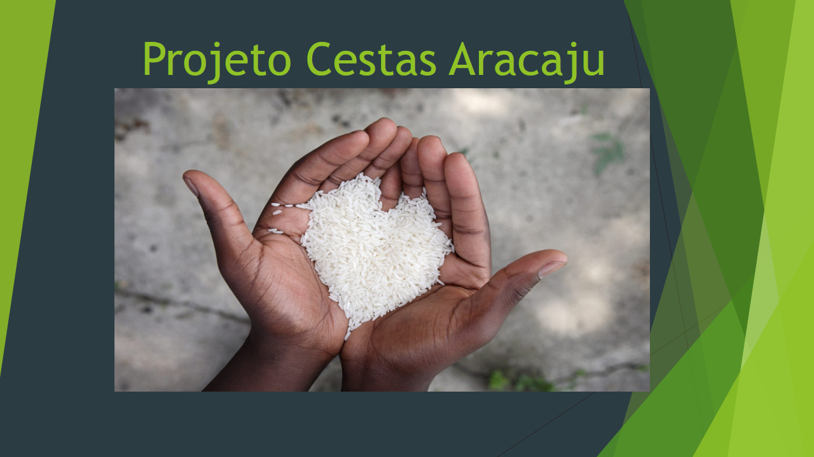
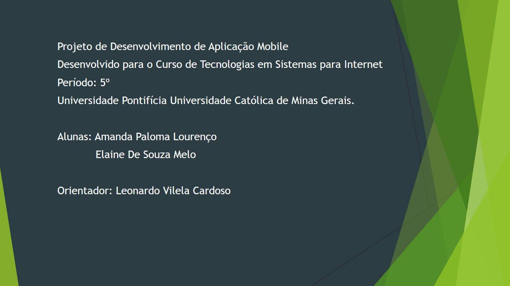
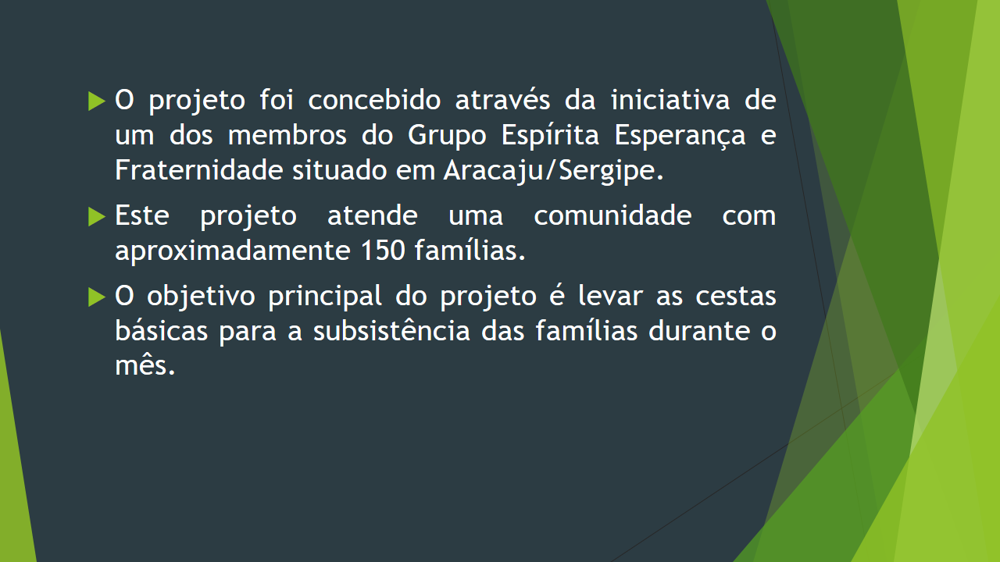
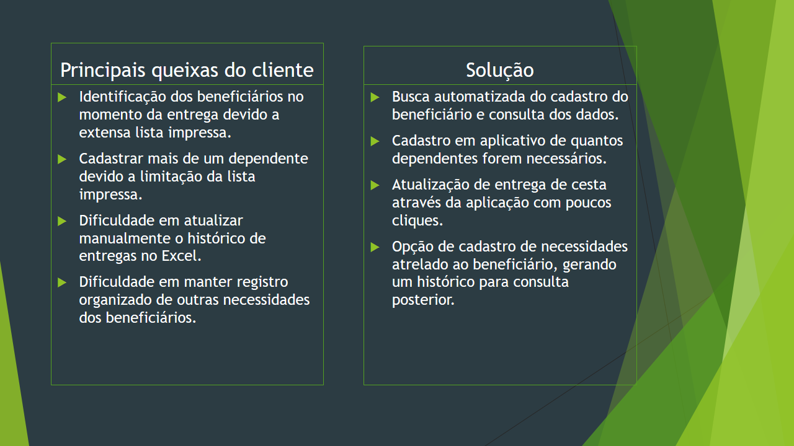
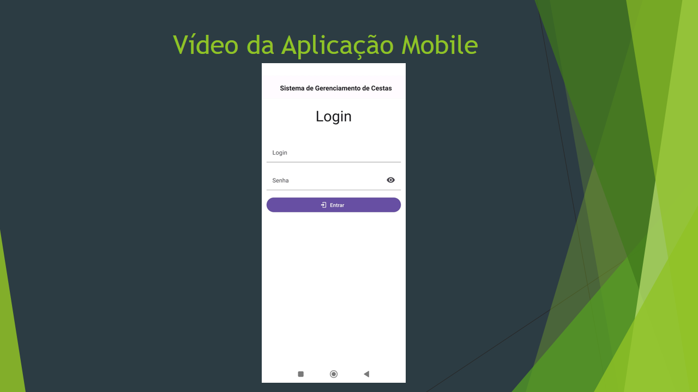

# Apresentação

**Vídeo da apresentação do projeto:**
 

https://youtu.be/wurB_geFs9g

 

**Vídeo do depoimento do voluntário Rafael Carvalho, falando sobre o projeto de distribuição de cestas e da importância da digitalização desse processo:**
 

https://youtu.be/NeIpLu1T90Y

## Título do Projeto

Projeto Cestas Aracaju

## Conjunto de Slides (Estrutura)

O projeto buscou atender as principais queixas do cliente, conforme  descrito no segundo slide. O desenvolvimento do projeto ocorreu em duas etapas: desenvolvimento back-end em .Net e posteriormente o desenvolvimento front-end em React native. A hospedagem ocorreu em nuvem pela Azure. A aplicação Mobile teve como foco sanar as principais dificuldades do cliente no quesito cadastro e consulta de beneficiário e dependentes, registro de cestas e necessidades adicionais.
 

